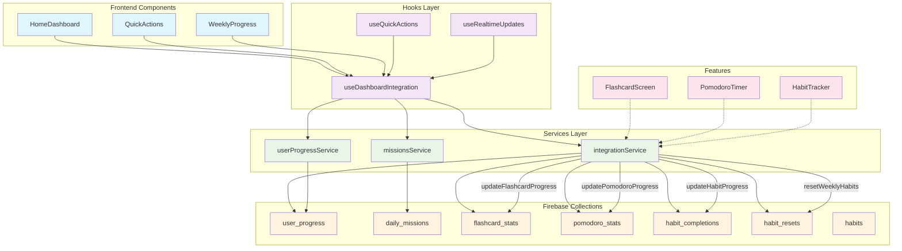

# Kiến trúc hệ thống tích hợp Dashboard StudyFlow



## Luồng dữ liệu

### 1. Flashcard Learning Flow

```
User học từ vựng → FlashcardScreen → integrationService.updateFlashcardProgress()
→ Firebase collections → Dashboard cập nhật realtime
```

### 2. Pomodoro Completion Flow

```
User hoàn thành Pomodoro → PomodoroTimer → integrationService.updatePomodoroProgress()
→ Firebase collections → Dashboard cập nhật realtime
```

### 3. Habit Tracking Flow

```
User đánh dấu thói quen → HabitTracker → integrationService.updateHabitProgress()
→ Firebase collections → Weekly reset logic → Dashboard cập nhật realtime
```

### 4. Quick Actions Flow

```
User click Quick Action → useQuickActions → integrationService methods
→ Firebase collections → Dashboard cập nhật ngay lập tức
```

## Tích hợp giữa các tính năng

- **Flashcard ↔ Pomodoro**: Thời gian học từ vựng được track trong pomodoro stats
- **Pomodoro ↔ Habits**: Pomodoro completion có thể trigger habit completion
- **Habits ↔ Flashcard**: Thói quen học tập ảnh hưởng đến flashcard progress
- **Weekly Reset**: Tất cả habits được reset mỗi tuần, ảnh hưởng đến weekly progress
